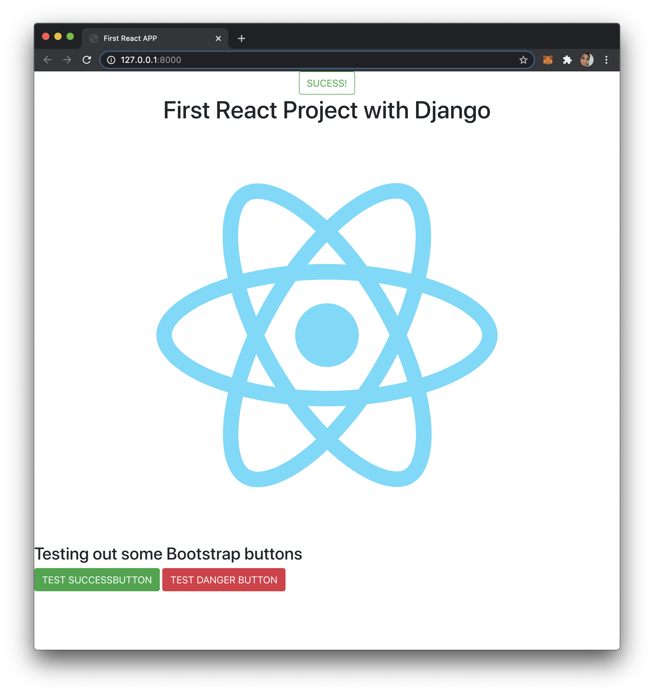

# My First Django with React
This is my first project implementing React in a Django project. This Django+React project is not able to be uploaded to Heroku. Look at my [second project](https://github.com/caocmai/django-react-heroku) for an example with Django+React to Heroku deployment.

## Prerequisites
Must have [Django v3.1.1](https://docs.djangoproject.com/en/3.1/topics/install/) and [Node.js v12.19.0](https://nodejs.org/en/) installed, preferably in a virtual environment(virtualENV or pipENV)

## To Run Locally
Once you clone the project navigate to the `reactapp` folder to install npm packages and build the React file by executing:
```
$ npm install
$ npm run build
```

Then navigate back to the root of the project and run:
```
$ python3 manage.py runserver
```

Go to your broswer and in the URL address bar type in: 
`http://127.0.0.1:8000/`

## Screenshot
I am able to add Bootstrap to React as well.
